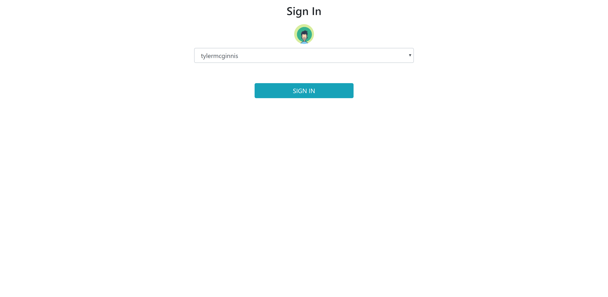
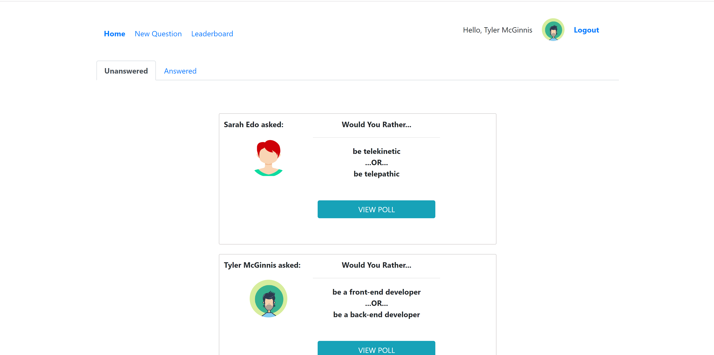
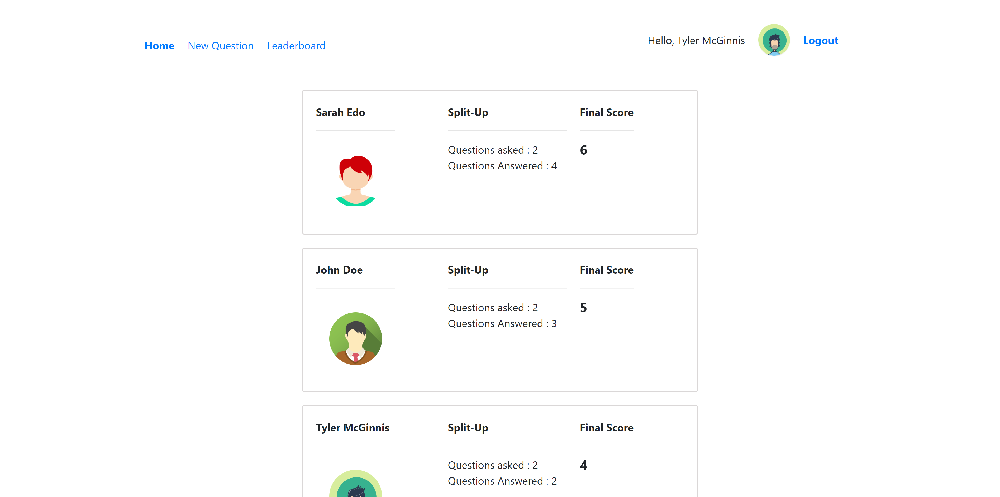

# Would You Rather

---

## Project Purpose:

This is a Udacity React Nanodegree Project. This project is a Would You Rather app where a user can login, add question to the forum to view, answer questions asked and view leaderboard for the score. The purpose of this project is to demonstrate the react with redux fundamentals like using actions, middleware, reducers, thunk, logger, optimistic updates, ContextAPI and components along with Routing between components providing a consistency in state management and flow of the pages.

## How to Load the App

The project uses Node.js and the Create-React-App starter. If you do not have Node >= 6.x installed, you can download it here: [Node.js](https://nodejs.org/en/)

Once Node is installed, navigate to the directory where you want to store the app

```
git clone https://github.com/harishb93/would-you-rather.git
npm install
```

Once all of the dependencies have been installed you can launch the app with

```
npm start
```

A new browser window should automatically open displaying the app. If it doesn't, navigate to [http://localhost:3000/](http://localhost:3000/) in your browser



## How to Use the App

- Selected user can view his/her answered and unanswered questions
- User can ask a new question which is globally available to all users
  

- User can view his/her position in the leaderboard
  
_Note: The backend API can store data only limited to the session. On refresh, the newly added data is lost_
